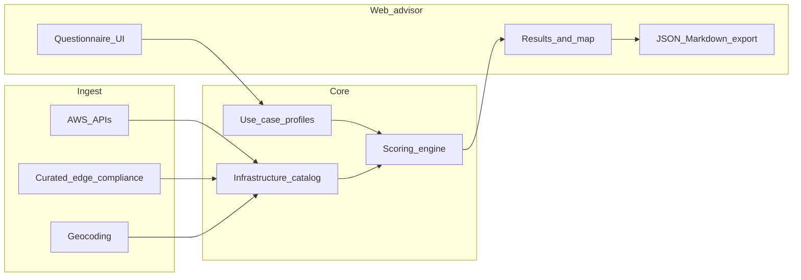

# AWS Region & Edge Advisor — Product & Architecture Plan (v1)

## Verdict

Build a **web advisor** that turns use-case answers (users, data location, latency, privacy/residency, workload type) into ranked recommendations across AWS **Regions**, **Availability Zones**, **Local Zones**, **Wavelength Zones**, and **edge (CloudFront / PoP)** placements. No application code in this phase — this document is the build blueprint.

---

## Problem

AWS global infrastructure is hard to reason about as one system:

| Layer | What it is | Typical decision |
| --- | --- | --- |
| Region | Geographic cluster of AZs (full service catalog) | Where primary data & control plane live |
| Availability Zone | Isolated datacenter group inside a Region | HA / multi-AZ design |
| Local Zone | Extension of a Region closer to a metro | Ultra-low latency compute near users |
| Wavelength Zone | Carrier edge (5G) attached to a Region | Mobile / MEC apps |
| Edge location / PoP | CloudFront, Route 53, AWS WAF, Shield, Lambda@Edge | CDN, DNS, edge compute, DDoS |
| Regional edge cache | Intermediate CloudFront cache | Cache hierarchy (informational) |
| Outposts / Dedicated Local Zones | Customer-premises or restricted locales | Later phase (v1: document only) |

People need help answering: *Where should my app run? Where can user traffic terminate? Where must data stay? What edge footprint is closest to my audience?*

---

## Product vision (v1)

**One guided flow** → **scored recommendations** → **explainable rationale** (why this Region / edge / privacy posture).

Primary lens for scoring (balanced):

1. **Geography & latency** — proximity of Regions / Local Zones / edge PoPs to users and data.
2. **Privacy & residency** — country/region constraints, sovereignty-style rules, opt-in Regions.
3. **Workload fit** — which placement type matches the use case (API backend vs CDN vs gaming vs mobile MEC vs batch analytics).

Target users: architects, platform engineers, and product owners choosing an initial AWS footprint.

---

## Explicit non-goals (v1)

- Deploying infrastructure or writing Terraform/CDK for the user.
- Live multi-region latency probing from the user’s network (use published city/coords + optional third-party RTT datasets later).
- Exhaustive service-availability matrix for every AWS product in every Region (start with coarse “core vs limited” flags; deepen later).
- Legal advice; compliance tags are **guidance**, not certification.
- Managing AWS accounts, SCPs, or opt-in API calls on behalf of the user (advise; don’t mutate).

---

## AWS inventory: what to collect

### Authoritative / API-backed

| Asset | Source | Notes |
| --- | --- | --- |
| Regions (enabled + opt-in) | Account/EC2 `DescribeRegions`, docs tables | Include geography, opt-in required |
| AZs, Local Zones, Wavelength | `DescribeAvailabilityZones` (`AllAvailabilityZones`, `zone-type`) | Parent Region, group name, network border group |
| Partition | `aws` / `aws-cn` / `aws-us-gov` | Separate catalogs; v1 focuses on `aws` commercial |

### Curated / scraped / manually maintained (no complete public API)

| Asset | Source | Notes |
| --- | --- | --- |
| CloudFront edge locations (cities / PoPs) | AWS Global Infrastructure + CloudFront docs | City-level, not street addresses |
| Regional edge caches | Same | Secondary; show in detail views |
| Compliance programs by Region | AWS Artifact / compliance docs | Map GDPR, HIPAA, FedRAMP, etc. as tags |
| Service presence (coarse) | AWS Regional Services List | Optional enrichment for “needs X service” |

### Derived attributes (our data layer)

- Lat/long per Region HQ city, Local Zone metro, edge city (geocode once, store).
- Country / sovereign territory codes (ISO 3166).
- Distance / Haversine to user-supplied audience cities.
- Privacy posture buckets (e.g. `eu-data-residency`, `us-only`, `china-partition`, `gov-partition`).

Refresh strategy: scheduled sync for API assets (daily); curated edge/compliance tables versioned in-repo or CMS with changelog.

---

## Domain model (conceptual)

```
InfrastructureNode
  id, type (region | az | local_zone | wavelength | edge_pop | regional_edge_cache)
  code, display_name
  parent_region_id?
  country_codes[], coordinates
  opt_in_required, partition
  compliance_tags[]
  capabilities[]          # e.g. full_region, edge_cdn, edge_compute, mec_5g

UseCaseProfile
  audience_locations[]    # city or country
  data_residency_rules[]  # allow/deny countries or partitions
  latency_class           # best_effort | low | ultra_low | mec
  workload_archetype      # web_api | static_cdn | realtime_media | mobile_5g | analytics | hybrid
  privacy_preferences     # encryption_in_region, no_cross_border, edge_pii_ok | edge_pii_forbid
  must_have_services[]    # optional coarse list
  multi_region_strategy   # single | active_passive | active_active

Recommendation
  primary_region
  secondary_regions[]
  edge_strategy           # cloudfront_global | cloudfront_price_class | local_zone | wavelength | none
  closest_edge_pops[]
  privacy_posture_summary
  score, score_breakdown
  rationale[]             # human-readable bullets
  risks_and_tradeoffs[]
```

---

## Recommendation engine

### Input: short questionnaire (web)

1. **Where are users?** (multi city/country)
2. **Where must data stay?** (anywhere / specific countries / EU / US / deny list)
3. **Latency need?** (normal web, low, single-digit ms metro, mobile edge)
4. **What are you building?** (API/app, CDN-heavy, media/gaming, 5G/MEC, data/analytics, hybrid)
5. **PII at the edge?** (forbid Lambda@Edge/Functions processing of PII vs allow)
6. **HA?** (single Region + multi-AZ vs multi-Region)

### Scoring (transparent, weighted)

| Factor | Weight (v1 default) | Idea |
| --- | --- | --- |
| Geo proximity to audience | 0.30 | Distance to Region + Local Zone + edge city |
| Residency / privacy fit | 0.30 | Hard filter on deny rules; soft score on allow |
| Workload–placement fit | 0.25 | Archetype → preferred node types |
| Operational simplicity | 0.15 | Prefer fewer Regions; avoid opt-in unless needed |

**Hard filters first** (eliminate invalid nodes), then rank survivors.

### Workload → placement heuristics

| Archetype | Prefer | Deprioritize |
| --- | --- | --- |
| `static_cdn` | Global edge PoPs + origin Region near content/team | Local Zones unless origin needs them |
| `web_api` | Single primary Region near users/data; multi-AZ; CloudFront optional | Wavelength |
| `realtime_media` / gaming | Local Zones near metros; Region parent for durable state | Distant single Region only |
| `mobile_5g` | Wavelength where available + parent Region | Pure edge PoP as compute home |
| `analytics` | Region with needed data services; residency wins over edge | Edge as primary |
| `hybrid` | Region + CloudFront; call out Local Zone only if latency class demands it |

### Privacy / residency rules (engine behavior)

- **Allow-list countries** → only Regions (and Local Zones whose parent Region) whose data-plane geography satisfies the list.
- **EU-style residency** → prefer EU Regions; flag US Regions and cross-border CloudFront behaviors; recommend origin in-region and careful edge caching of personal data.
- **Edge PII forbid** → still recommend CloudFront for static/cacheable non-PII; recommend origin fetch for sensitive APIs; discourage Lambda@Edge for PII transforms.
- **Gov / China partitions** → separate path: “you need `aws-us-gov` or `aws-cn`,” not mixed into commercial ranking.

Always show **why**, **what was filtered out**, and **residual risks** (e.g. “edge caches may still terminate TLS outside residency country”).

### Outputs (v1 screens)

1. **Top primary Region** + 1–2 alternates, with score bars.
2. **Closest edge locations** to each audience city (top N PoPs).
3. **Optional Local Zone / Wavelength** callouts when latency class or archetype warrants them.
4. **Privacy posture card** — residency match, edge PII stance, opt-in Regions required.
5. **Export** — JSON + short markdown summary (for RFCs / architecture docs).

---

## Web advisor UX (v1)

- One composition: guided steps → results (not a dense multi-panel dashboard on first paint).
- Steps: Audience → Residency/Privacy → Latency & workload → Review → Results.
- Results: brand/product name as hero of the results view; one primary recommendation; expandable “alternates” and “closest edges.”
- Map view (optional but high value): audience pins, recommended Region, nearby PoPs/Local Zones.
- No deployment wizards in v1.

Mobile: same flow, stacked; map collapses to list.

---

## System architecture



### Suggested stack (implementation phase — not built now)

- **Frontend**: SPA (React or similar) for the wizard + results/map.
- **Backend**: small API (catalog read, score endpoint, optional save profile).
- **Store**: Postgres or embedded DB for catalog + saved profiles; versioned JSON seed for edge cities if starting minimal.
- **Jobs**: cron/worker to refresh Regions/AZs/Local/Wavelength from AWS APIs.

Auth: optional in v1 (local/anonymous profiles); add accounts when sharing/saving matters.

---

## Data accuracy & trust

- Label every recommendation with **catalog version** and **as-of date**.
- Distinguish **API-synced** vs **manually curated** fields in the UI.
- Link out to AWS docs for Regions, Local Zones, CloudFront locations, and compliance.
- Never claim physical datacenter street addresses (AWS does not publish them).

---

## Delivery phases

### Phase 0 — this plan (done when accepted)
Product scope, model, scoring, UX, architecture.

### Phase 1 — catalog MVP
- Sync commercial Regions + AZs + Local Zones + Wavelength.
- Seed edge city list + coordinates.
- Admin/read API or static catalog JSON.

### Phase 2 — scoring + wizard
- Questionnaire, hard filters, weighted scores, rationale text.
- Closest-edge lookup per audience city.
- Privacy posture summary.

### Phase 3 — polish
- Map, export, saved profiles, compliance tag enrichment, coarse service-availability filters.

### Later
- Live latency samples, Outposts, price-class optimization, CDK/Terraform stubs, gov/China partitions as first-class.

---

## Success criteria (v1)

- User can enter audience + residency + workload and get a **ranked primary Region** with clear rationale in under a few minutes.
- For each audience city, show **nearest edge PoPs** from the seeded catalog.
- When ultra-low latency or 5G is selected, surface **Local Zone / Wavelength** options when they exist near the audience.
- Privacy rules **exclude** invalid Regions and explain edge/PII tradeoffs.
- Every result cites catalog freshness; no silent stale data.

---

## Relationship to this repository

This GitHub repo today hosts an EMR/Livy orchestration sample and a LinkedIn job monitor. The advisor is a **new product surface**. Implementation should live in a dedicated app directory or a new repository; do not conflate it with the Airflow/EMR pipeline unless product direction changes.

---

## Open decisions deferred to implementation

- Exact UI kit / hosting (Amplify, CloudFront+S3, etc.).
- Whether edge city list is vendored JSON or scraped with human review.
- Whether AWS credentials are required (only needed for live `Describe*` sync; public seed works for demo).

These do not block accepting this plan.
